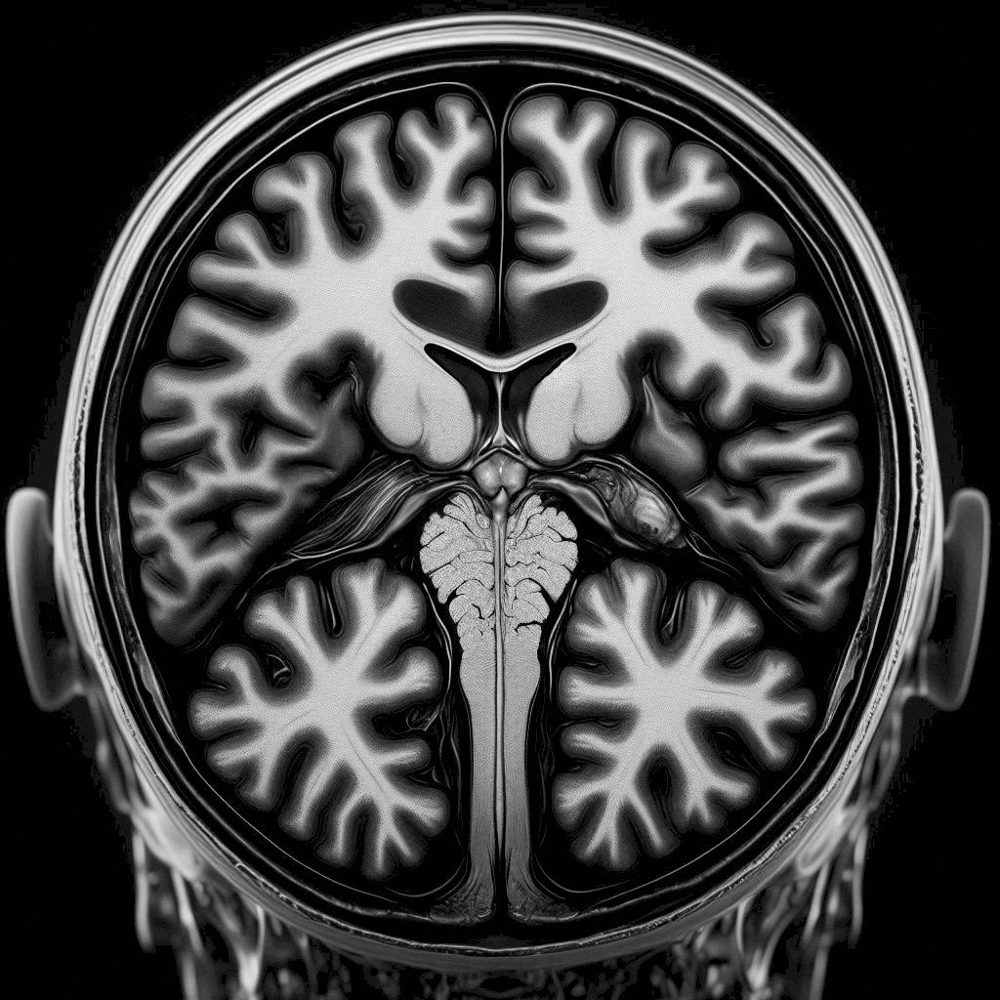
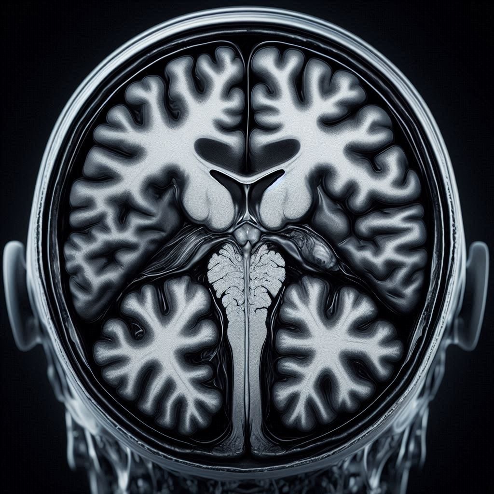
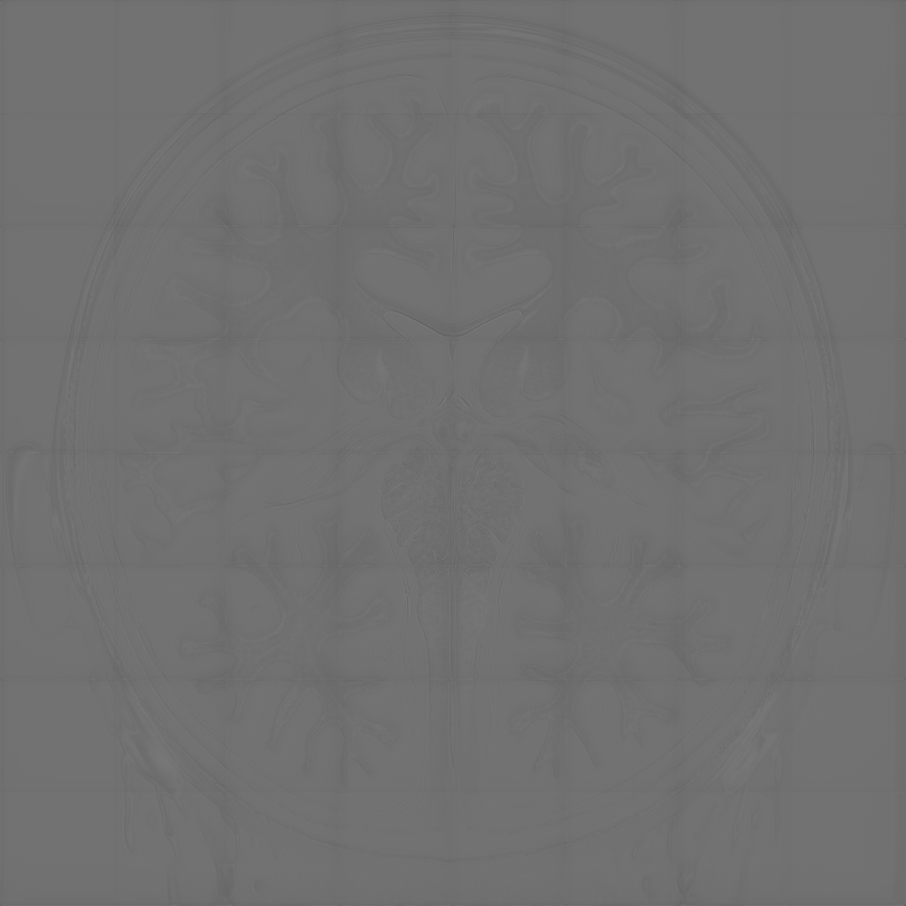
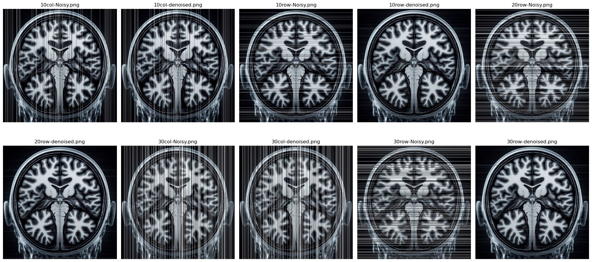

# Noise2Noise Self2Self

In this repo the challenge is to refine `Noise2Noise/Self2Self` models.   
> Find more details about results and training process in notebook!

## Noise2Noise Fine-tuning
In the Noise2Noise model, the following loss function is used:
$$
\begin{cases}
y_1 = x + n_1 \\
y_2 = x + n_2
\end{cases}
$$

$$
\mathbb{E}\left\{ \left\| f(y_1|\Theta) - y_2 \right\|_2^2 \right\}
$$

We aim to fine-tune the model using the following modified loss function:

$$
\begin{cases}
y_1 = x + n_1 \\
y_2 = x + n_2
\end{cases}
$$

$$
\mathbb{E}\left\{ \left\| f(y_1|\Theta) - y_2 \right\|_2^2 \right\} + \mathbb{E}\left\{ \left\| f(y_2|\Theta) - y_1 \right\|_2^2 \right\}
$$

**Data:** Two different random noise realizations  
($n_1, n_2 \sim \mathcal{N}(0, 0.01 \cdot \max(\text{GrayLevel}))$)  
Use image from file `Prob#4.png`.

### Inference 
| Aspect                  | Pretrained Model | Fine-tuned Model   |
|-------------------------|------------------|---------------------|
| **PSNR**                | 36.06 dB ✅      | 9.44 dB ❌          |
| **SSIM**                | 0.8654 ✅        | 0.1211 ❌           |
| **Visual Quality**      | Very good        |  medium |
| **Brightness/Grey Level** | Correct         | Shifted (darker)    |
| **Training Time**       | Full training     | Very short (10 epochs) |
| **Model Convergence**   | Fully converged   | Poor PSNR/SSIM but visually acceptable |

#### Noisy 

    

#### Original 

    

#### Denoised: Pretrained 

    

#### Denoised: Fine-tuned 

    

## Self2Self Model — Horizontal Line Recovery

In the Self2Self model, the loss function is based on estimating missing pixels using a Bernoulli masking distribution. In certain imaging systems, some horizontal lines may be completely lost due to random sensor burnout, appearing either white or black.

Update the inputs and loss function to estimate **missing horizontal lines** using the **existing horizontal content**.

### Inference

    

| Mask type                | PSNR ↑ | SSIM ↑  | Interpretation                                                                                                                                     |
|-------------------------|--------|---------|----------------------------------------------------------------------------------------------------------------------------------------------------|
| 10 % columns missing     | 14.20  | 0.6070  | Poor recovery of narrow missing “stripes.” The model was never trained to fill vertical cuts—it only saw dropped rows. With BS=1(mem shortage) it can’t generalize well to columnar gaps. |
| 30 % columns missing     | 9.40   | 0.2254  | Very poor: wider column gaps break the learned horizontal continuity. Self2Self’s partial‑conv U‑Net struggles without explicit columnar examples. |
| 10 % rows missing        | 26.34  | 0.7638  | Good: small horizontal gaps match training. The network learned to inpaint along rows.                                                            |
| 20 % rows missing        | 28.69  | 0.8404  | Better: moderate-row removal actually gives more context on either side of each gap, making the inpainting easier and more stable.               |
| 30 % rows missing        | 26.34  | 0.7638  | Slight drop vs 20 %. With very large row gaps, less vertical context remains per gap, so accuracy dips back down.                                 |
